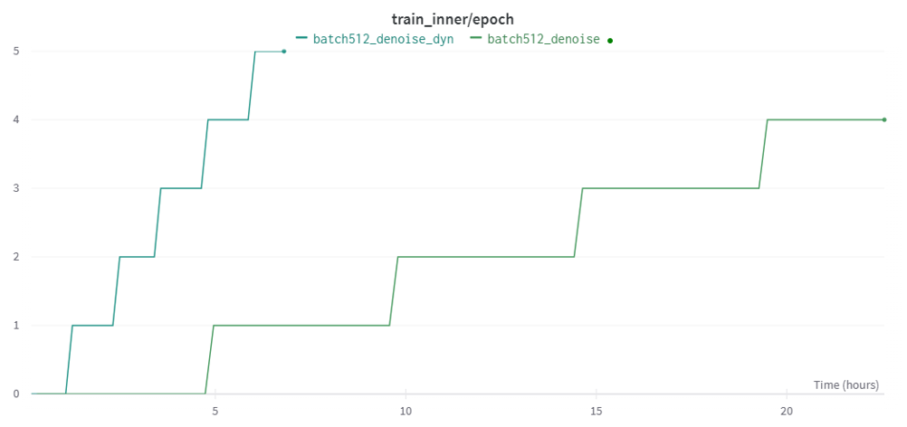

.. A4SFramework documentation master file, created by
   sphinx-quickstart on Mon Sep 25 05:01:57 2023.
   You can adapt this file completely to your liking, but it should at least
   contain the root `toctree` directive.

.. _datapipeline:

Data Pipeline
==================

Dynamic Batching
~~~~~~~~~~~~~~~~~~~
Dynamic batching is a technique used in training deep learning models, especially when dealing with sequences of varying lengths, such as in natural language processing (NLP) tasks. The primary goal of dynamic batching is to enhance efficiency and decrease computational overhead during the training process. This is achieved by grouping sequences with similar lengths into the same batch, which significantly reduces the amount of padding needed. Consequently, the model processes fewer padding tokens, leading to reduced computational overhead and faster training.

In addition to NLP tasks, dynamic batching can also be applied to biological sequences, such as nucleotide or amino acid sequences, to optimize the training process. Just like in NLP, grouping sequences of similar lengths together in the same batch minimizes the need for padding, resulting in lower computational overhead and accelerated training. In summary, dynamic batching is a valuable technique for efficiently training deep learning models on sequences of varying lengths across multiple domains, including NLP and bioinformatics.

The figure :ref:`dynamicbatching` shows the dynamic batching speed up the training process of protein data with more than 4 times. This significant improvement in training time demonstrates the effectiveness of dynamic batching in optimizing the deep learning model training process for sequences with varying lengths.

.. _dynamicbatching:

   Epoch vs. training time

To use the feature, your dataset needs to inheret from :class:`sfm.data.dataset.FoundationModelDataset` and implement the following methods:

.. automethod:: sfm.data.dataset.FoundationModelDataset.num_tokens

The :class:`sfm.data.prot_data.ProteinLMDBDataset` shows an example of how to implement the above methods. Also, The flag ``--dynamic_loader``, ``--max_tokens`` and ``--max_length`` needs to be set in the script. Find the details in the following example

.. code::

   bash scripts/pfm/pretrain_pfm.sh

Weighted Distributed Sampler
~~~~~~~~~~~~~~~~~~~~~~~~~~~~~~~

When training deep learning models with multiple datasets, it is essential to manage the distribution of samples to ensure that each dataset contributes effectively to the training process. The Weighted Distributed Sampler is specifically designed to assign weights to each dataset, allowing for a balanced and efficient sampling strategy. This sampler is implemented in the class

.. autoclass:: sfm.data.sampler.WeightedDistributedSampler
   :members:
   :undoc-members:
   :show-inheritance:
